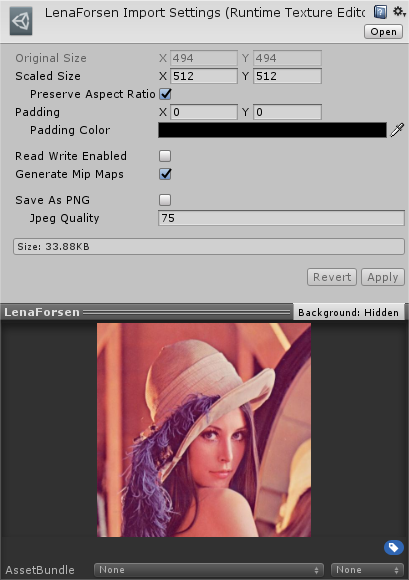

# Unity Runtime Texture

This asset is an abstraction layer on top of `Texture2D.LoadImage` to create **Texture2D** objects at runtime from raw *PNG/JPEG* data. Image files' contents are stored in **RuntimeTexture** assets and are used to create Texture2Ds on demand. With this abstraction layer, you no longer need to store the image files in e.g. *StreamingAssets* directory, you can hold references to RuntimeTexture assets in your scripts and generate Texture2Ds using them.

#### Pros

- Smaller build sizes since raw PNG/JPEG images are usually much smaller than uncompressed Texture2Ds
- No need to store image files in StreamingAssets folder or load them manually using Texture2D.LoadImage
- RuntimeTextures can be resized from the Inspector. Note that resized image's bytes will be calculated using *Texture2D.EncodeToPNG* or *Texture2D.EncodeToJPG*, resizing the image in e.g. Photoshop will probably produce a smaller image file

#### Cons

- Generated Texture2Ds will be uncompressed and thus, at runtime, will consume more memory compared to compressed Texture2Ds. Hence, RuntimeTexture is mostly useful for replacing already uncompressed Textures (like images in drawing games)

**Discord:** https://discord.gg/UJJt549AaV

**[Support the Developer ☕](https://yasirkula.itch.io/unity3d)**

## INSTALLATION

There are 4 ways to install this plugin:

- import [RuntimeTexture.unitypackage](https://github.com/yasirkula/UnityRuntimeTexture/releases) via *Assets-Import Package*
- clone/[download](https://github.com/yasirkula/UnityRuntimeTexture/archive/master.zip) this repository and move the *Plugins* folder to your Unity project's *Assets* folder
- *(via Package Manager)* add the following line to *Packages/manifest.json*:
  - `"com.yasirkula.runtimetexture": "https://github.com/yasirkula/UnityRuntimeTexture.git",`
- *(via [OpenUPM](https://openupm.com))* after installing [openupm-cli](https://github.com/openupm/openupm-cli), run the following command:
  - `openupm add com.yasirkula.runtimetexture`

**NOTE:** Requires *Unity 2017.2* or later.

## HOW TO

There are two ways to create **RuntimeTexture** assets:

1. By default, RuntimeTexture assets use "*.img*" extension (can be changed from *RuntimeTextureImporter.cs*). You can simply save your PNG/JPEG images with *.img* extension
2. Right click a *Texture* asset in Project window and select "*Convert To Runtime Texture*" to create a RuntimeTexture asset from that Texture

RuntimeTexture assets have the following properties:

- `Texture2D Texture { get; }`: if a Texture2D isn't yet created for this RuntimeTexture, generates a Texture2D using Texture2D.LoadImage and returns it. Later calls will simply return that existing Texture2D
- `int Width { get; }`: width of the image
- `int Height { get; }`: height of the image
